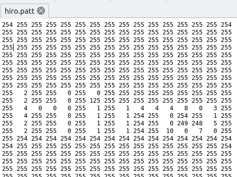

# PyMarker

A python package to manage Augmented Reality markers and patterns based on input images. This package is capable of generating black borders around images to be used as AR markers and also removing them in cases where you need to automatize the process.

## Installation

PyMarker is available through pip and [Pypi](https://pypi.org/project/pymarker/).

```bash
python3 -m pip install pymarker --user
// or
pip3 install pymarker --user
```

## Usage

Pymarker provides three features for a marker-based AR: generating Pattern files (.patt); Markers images (.png); Removing borders of existing Marker images. The marker will be used by the user to visualize some augmented reality, the pattern file for the system to be able to recognize the marker.

An example input image:


Expected output patt:



Expected output marker:


Using the remove feature, we can return this marker to the starter image back again:


### Commands

PyMarker now uses subcommands for its CLI interface.

#### Generate markers and patt files

By default, the `generate` subcommand receives an image and generates both patt and marker files:

```bash
$ pymarker generate tests/input/hiro.jpg
```

To generate only the patt file for the input, use the `-p` or `--patt` flag:

```bash
$ pymarker generate -p tests/input/hiro.jpg
# or
$ pymarker generate --patt tests/input/hiro.jpg
```

To generate only the marker, use the `-m` or `--marker` flag:

```bash
$ pymarker generate -m tests/input/hiro.jpg
# or
$ pymarker generate --marker tests/input/hiro.jpg
```

You can adjust the marker border size with `-b` (black border, default 20%) and `-w` (white border, default 3%):

```bash
$ pymarker generate -b 40 -w 5 tests/input/hiro.jpg
```

You can also specify an output path with `-o` or `--output`:

```bash
$ pymarker generate -o output_dir/ tests/input/hiro.jpg
```

#### Remove borders from marker images

To remove borders from a marker image, use the `remove` subcommand:

```bash
$ pymarker remove tests/input/marker.png
```

You can specify an output path for the result:

```bash
$ pymarker remove -o output_dir/ tests/input/marker.png
```

### Modules

You can use the functions directly from your python code to generate markers and patts.

```python
from pymarker.core import generate_patt, generate_marker

def main():
    filename = "tests/input/hiro.jpg"
    border_size = 50 // size in percentage

    generate_patt(filename)
    generate_marker(filename,border_size)

```
